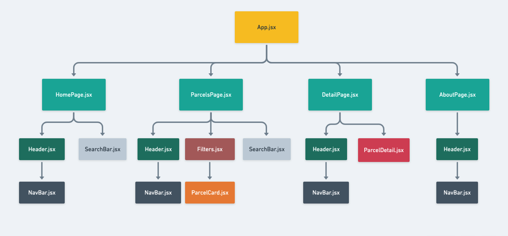
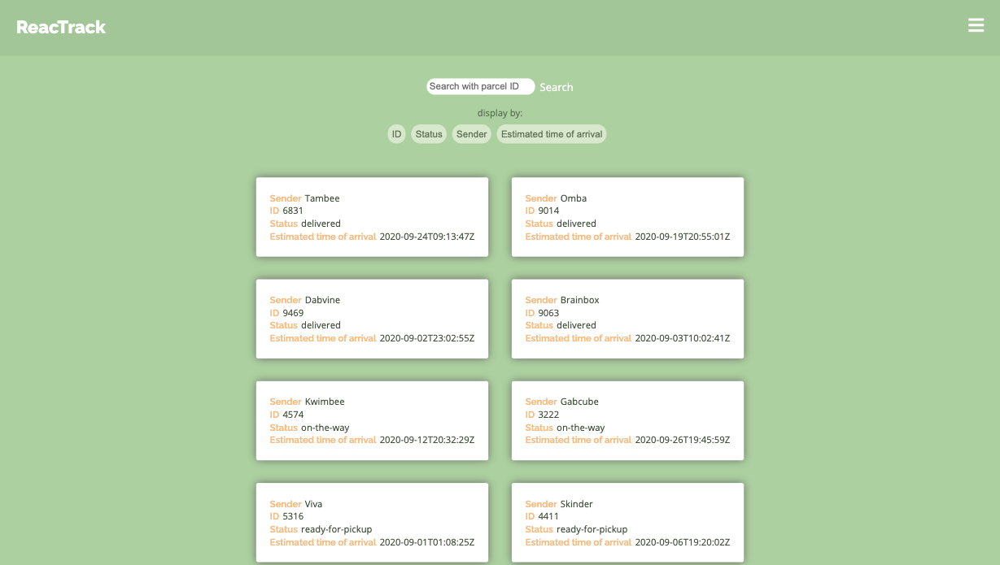
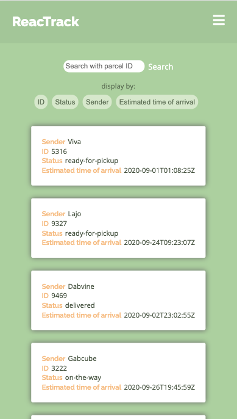
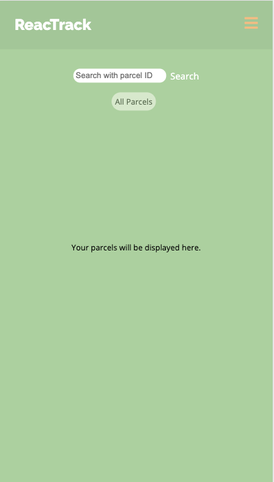
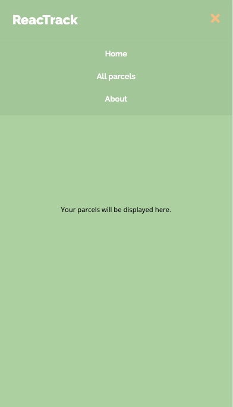
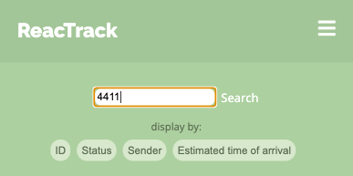
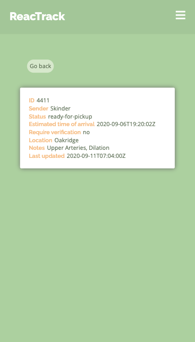
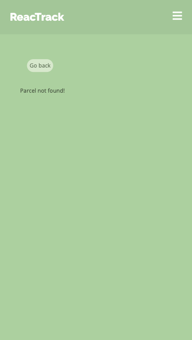
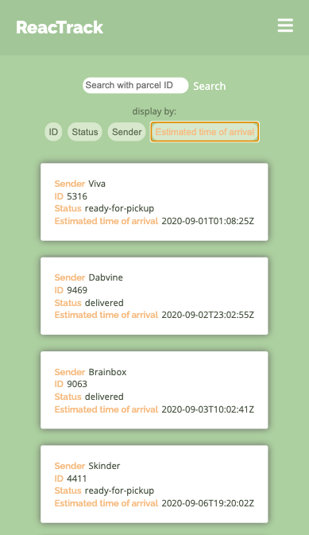
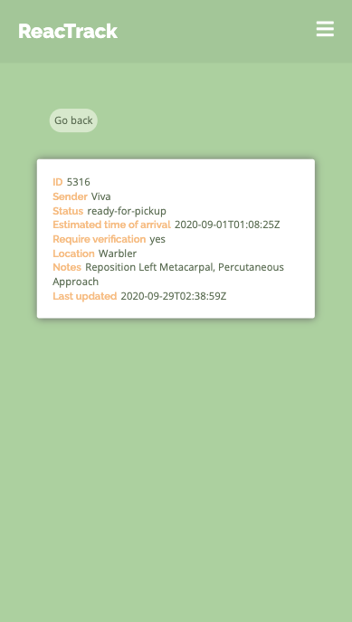

# ReacTrack

A parcel tracking app built with React. 

## Start app
1. Install required dependencies with `npm install` 
2. `npm start` to run this app in development mode.\
Open [http://localhost:3000](http://localhost:3000) to view it in the browser.

## Project structure
The structure of the project is shown as below: 

## Design Features
### Responsive Display

This app has a responsive design to fit both mobile device and desktop. 

### Dropdown Menu
Click on the button on the upper right corner to open dropdown menu.

### Search Bar
Type the parcel id to get parcel details. 

Invalid parcel id will not match any parcel.

### All Parcels Page
Click **All Parcels** menu to show all parcels:

Click filter buttons to display parcels in specific order:

### Parcel Detail Page

Click parcel card to show details.

